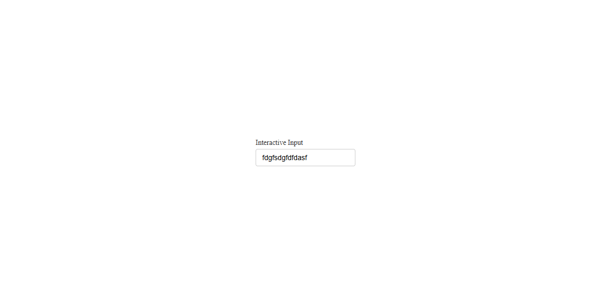
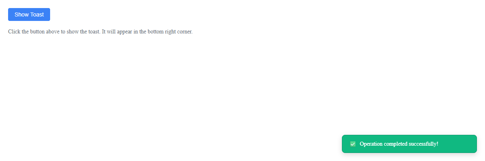
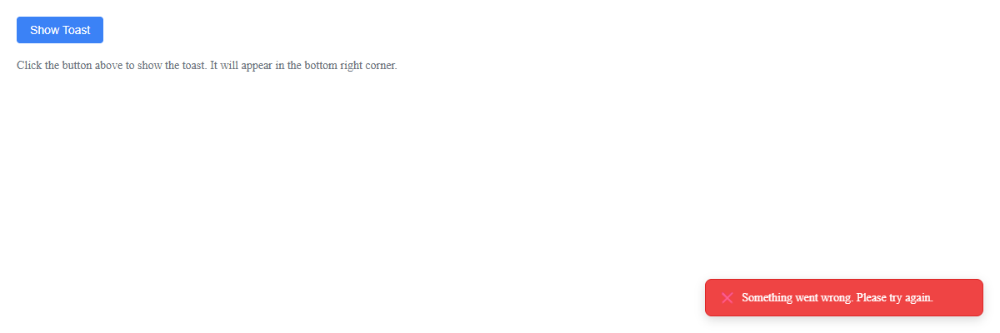
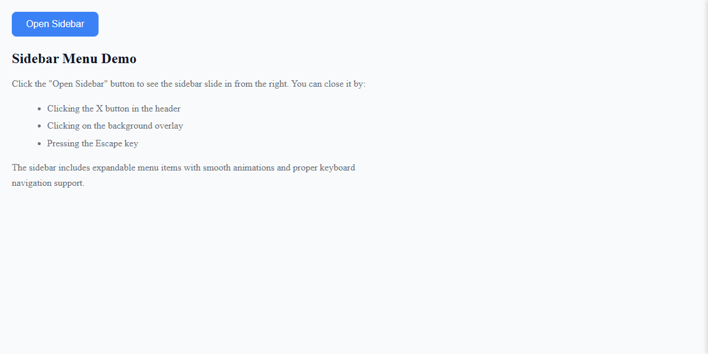
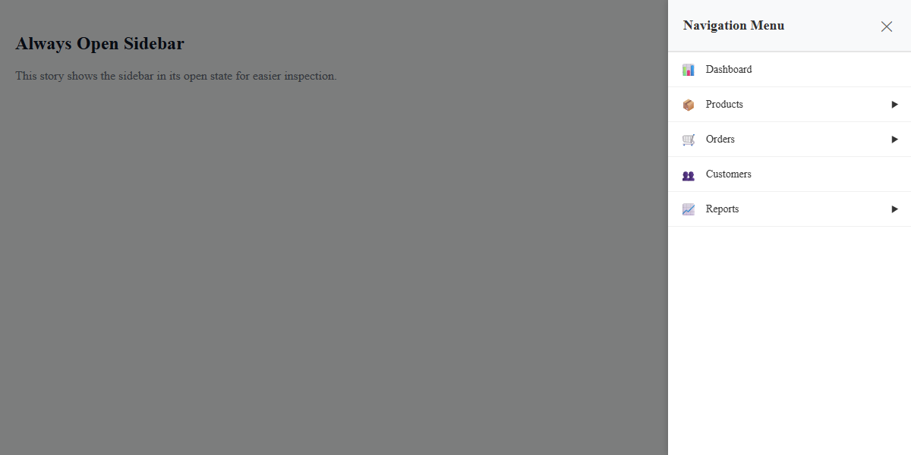

# 🎨 Design System Component Library

A modern, accessible React component library built with Storybook, featuring a comprehensive design system with design tokens, TypeScript support, and extensive documentation.

## ✨ Features

- 🎯 **Design System**: Comprehensive design tokens for colors, typography, spacing, and more
- 📚 **Storybook Documentation**: Interactive component playground and documentation
- 🧩 **Modular Architecture**: Well-organized component structure with co-located styles and stories
- ♿ **Accessibility First**: Built with accessibility best practices
- 🎨 **CSS Modules**: Scoped styling with design token integration
- 📱 **Responsive Design**: Mobile-first approach with responsive breakpoints
- 🔧 **TypeScript**: Full type safety and excellent developer experience
- 🧪 **Testing Ready**: Vitest integration for component testing

## 🚀 Quick Start

### Prerequisites

- Node.js 18+
- npm or yarn

### Installation

```bash
# Clone the repository
git clone https://github.com/yourusername/design-system-component-library.git
cd design-system-component-library

# Install dependencies
npm install

# Start Storybook
npm run storybook
```

## 📦 Available Components

### Atoms

- **Input** - Versatile input component with password toggle, clearable functionality, and form support
- **Toast** - Notification system with multiple types and auto-dismiss functionality

### Molecules

- **Sidebar** - Slide-out navigation with nested menu support and keyboard navigation

## 📸 Component Showcase

### Input Component States



**Available States:**

- Default state with placeholder
- Focused state with active styling
- Error state with validation message
- Disabled state
- Password field with visibility toggle
- Clearable input with clear button

### Toast Component Variants




**Available Types:**

- Success toast with green styling
- Error toast with red styling
- Warning toast with yellow styling
- Info toast with blue styling
- With/without close button
- Different durations and positioning

### Sidebar Component Examples




**Available Configurations:**

- Closed state with trigger button
- Open state with menu items
- Nested menu with expandable items
- Different widths and themes
- Mobile responsive behavior

## 🎨 Design System

Our design system is built on a foundation of design tokens that ensure consistency across all components.

### Color Palette

- **Primary**: Blue (#3b82f6) - Main brand color
- **Semantic Colors**: Success, Error, Warning, Info
- **Neutral Grays**: Text, borders, and backgrounds

### Typography

- **Font Sizes**: 12px to 48px scale
- **Font Weights**: Regular (400) to Bold (700)
- **Line Heights**: Optimized for readability

### Spacing System

- **4px Base Unit**: Consistent spacing scale
- **Tokens**: xs (4px) to 3xl (32px)
- **Responsive**: Mobile-first approach

## 🏗️ Project Structure

```
src/
├── components/           # Component library
│   ├── Input/           # Input component
│   │   ├── Input.tsx
│   │   ├── Input.module.css
│   │   ├── Input.stories.tsx
│   │   └── __stories__/ # Story-specific files
│   │       ├── helpers/ # Wrapper components
│   │       ├── examples/# Example components
│   │       └── styles/  # Story-specific styles
│   ├── Sidebar/         # Sidebar component
│   └── Toast/           # Toast component
├── styles/              # Global styles
│   └── design-tokens.css # Design system tokens
└── stories/             # Storybook documentation
    ├── Introduction.mdx
    ├── GettingStarted.mdx
    └── DesignTokens.mdx
```

## 🎯 Usage Examples

### Basic Input Usage

```tsx
import { Input } from "./components/Input/Input";

function LoginForm() {
  const [email, setEmail] = useState("");
  const [password, setPassword] = useState("");

  return (
    <form>
      <Input
        label="Email"
        type="email"
        value={email}
        onChange={setEmail}
        placeholder="Enter your email"
        clearable
      />
      <Input
        label="Password"
        type="password"
        value={password}
        onChange={setPassword}
        placeholder="Enter your password"
      />
    </form>
  );
}
```

### Toast Notifications

```tsx
import { Toast } from "./components/Toast/Toast";

function App() {
  const [showToast, setShowToast] = useState(false);

  return (
    <div>
      <button onClick={() => setShowToast(true)}>Show Success Toast</button>

      {showToast && (
        <Toast
          message="Operation completed successfully!"
          type="success"
          duration={4000}
          onDismiss={() => setShowToast(false)}
        />
      )}
    </div>
  );
}
```

### Adding New Components

1. Create component directory: `src/components/ComponentName/`
2. Add component files: `ComponentName.tsx`, `ComponentName.module.css`
3. Create stories: `ComponentName.stories.tsx`
4. Add story helpers: `__stories__/helpers/` and `__stories__/styles/`
5. Update documentation

## 🎨 Customization

### Design Tokens

All styling is controlled through CSS custom properties (design tokens):

```css
:root {
  --color-primary: #3b82f6;
  --spacing-lg: 16px;
  --font-size-lg: 18px;
  --border-radius-md: 4px;
}
```

### Theming

Create custom themes by overriding design tokens:

```css
[data-theme="dark"] {
  --color-primary: #60a5fa;
  --color-gray-900: #f9fafb;
  --color-gray-50: #111827;
}
```

## 📚 Documentation

- **[Getting Started](./stories/GettingStarted.mdx)** - Quick setup guide
- **[Design Tokens](./stories/DesignTokens.mdx)** - Complete design system reference
- **[Component API](./stories/Introduction.mdx)** - Component documentation

## 🤝 Contributing

We welcome contributions! Please see our [Contributing Guidelines](./CONTRIBUTING.md) for details.

### Development Setup

1. Fork the repository
2. Create a feature branch: `git checkout -b feature/amazing-feature`
3. Make your changes
4. Add tests if applicable
5. Commit your changes: `git commit -m 'Add amazing feature'`
6. Push to the branch: `git push origin feature/amazing-feature`
7. Open a Pull Request

## 📄 License

This project is licensed under the MIT License - see the [LICENSE](./LICENSE) file for details.

## 🙏 Acknowledgments

- [Storybook](https://storybook.js.org/) for the amazing documentation platform
- [React](https://reactjs.org/) for the component framework
- [Vite](https://vitejs.dev/) for the build tooling
- [TypeScript](https://www.typescriptlang.org/) for type safety

## 📞 Support

- 📧 Email: support@yourcompany.com
- 💬 Discord: [Join our community](https://discord.gg/your-invite)
- 🐛 Issues: [GitHub Issues](https://github.com/yourusername/design-system-component-library/issues)

---

<div align="center">

[](https://your-storybook-url.netlify.app)
[](https://reactjs.org/)
[](https://www.typescriptlang.org/)
[](https://vitejs.dev/)

</div>
